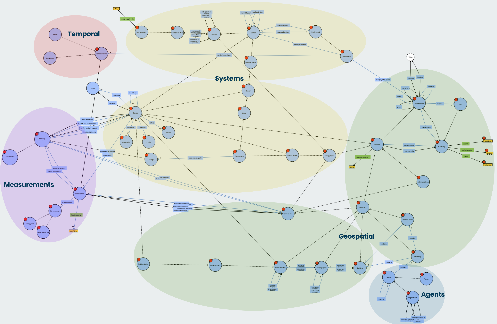
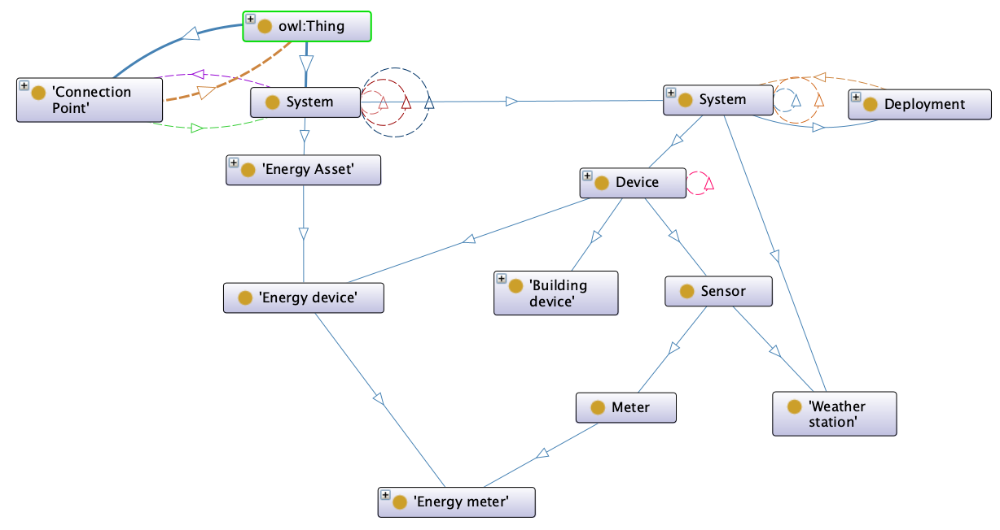
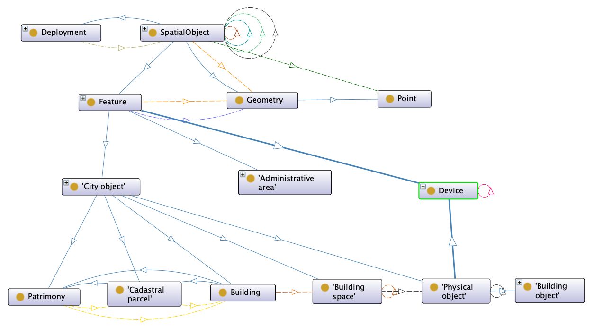
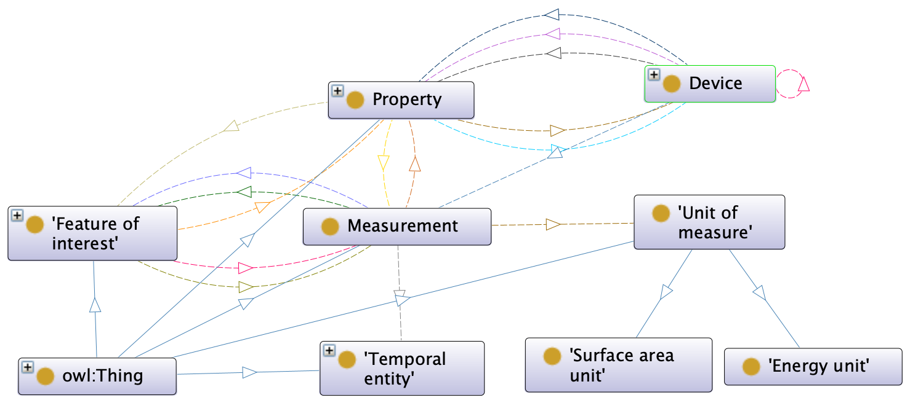
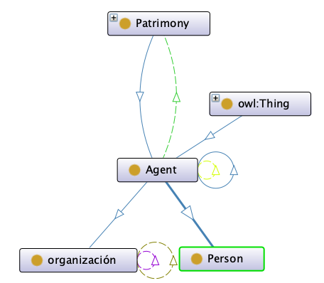
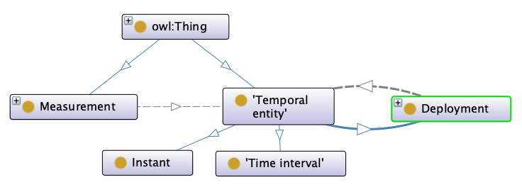
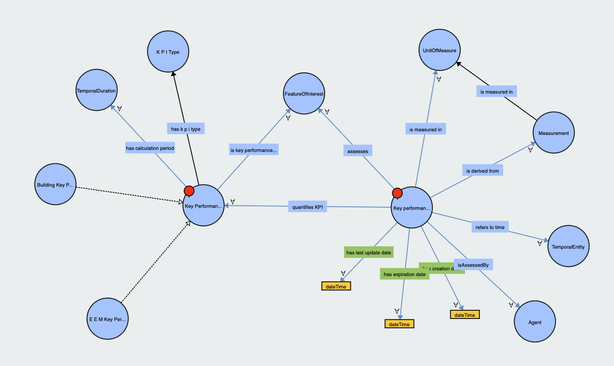
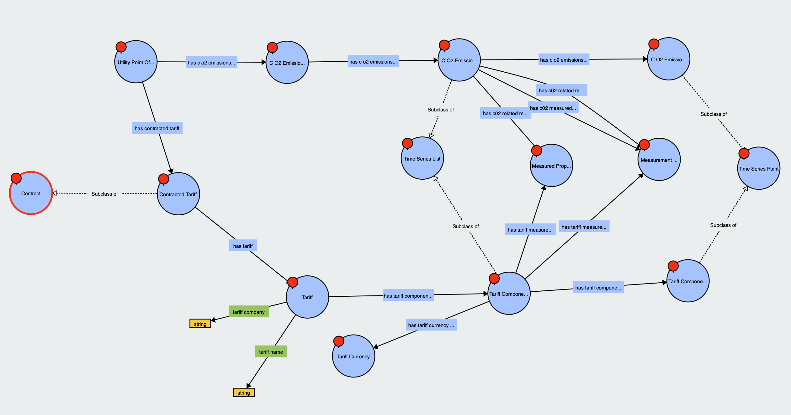

# Bigg Ontology

The BIGG Ontology is an open-source initiative that establishes a standardised schema
for describing, characterising, and analysing buildings and urban areas. This ontology supports urban planning, building
management, and sustainable development by creating a shared vocabulary for researchers and practitioners. This common
language facilitates the sharing and integrating information within the urban development domain. The ontology also
includes a framework for defining measurements and key performance indicators (KPIs) to enable precise evaluation and
benchmarking of building and urban area performance. This repository documents the ongoing development of the ontology
and provides essential resources for its application.



The BIGG ontology uses the Terse RDF Triple Language (Turtle) to represent information. It is built using the Web
Ontology Language (OWL), which is based on the Resource Description Framework (RDF) XML standard set by the World Wide
Web Consortium (W3C). This method guarantees a strong and standardized framework for representing and exchanging
semantic data within the ontology.

## Key Components

The BIGG ontology is divided into 5 main components:

- **Systems**: Describe and analyze the various systems, sensors, devices, and weather stations within buildings and
  urban areas, including their functions, interconnections, and performance. This ensures efficient operation,
  maintenance, and integration of systems, leading to enhanced overall building performance and reliability.

  

- **Geospatial**: Capture and analyze spatial characteristics and geographic information of buildings and urban areas.
  This supports urban planning, optimal land use, site selection, and environmental impact assessments, thereby
  facilitating informed decision-making and efficient spatial management.

  

- **Measurements**: Catalogue and standardize the various devices and sensors used in buildings and urban areas for data
  collection and control. This includes meters, thermostats, smart appliances, and sensors measuring temperature,
  humidity, occupancy, and energy consumption. Standardizing these devices and sensors ensures accurate and consistent
  data capture across different environments, facilitating reliable monitoring, data collection, analysis, and informed
  decision-making.

  

- **Agents**: Identify and categorize the various stakeholders and entities involved in the lifecycle of buildings and
  urban areas. This promotes effective coordination, compliance with regulations, and collaboration among stakeholders,
  leading to more efficient and cohesive management of urban environments.

  

- **Temporal**: Address the timing of events, lifecycle phases of systems and components, and historical data related to
  buildings and urban areas. This enables time-based analysis and planning, prediction of future needs, scheduling of
  maintenance activities, and evaluation of long-term trends, ensuring proactive management and sustainability of urban
  assets.

  

## Extensions

- **KPI**: Establish a set of standardized metrics for evaluating the performance of buildings and urban areas. These
  KPIs allow for benchmarking, performance assessment, and identifying areas for improvement, supporting strategies for
  enhanced efficiency and sustainability.

  

- **Tariff**: Define and analyse the tariffs and pricing structures related to utilities and services in buildings and
  urban areas. This includes understanding cost implications for energy, water, waste management, and other services,
  enabling better financial planning, cost management, and policy development. By analysing tariffs, stakeholders can
  optimise resource usage, manage budgets effectively, and make informed decisions on service contracts and procurement
  strategies.

  

## Dictionaries & Taxonomies

##### External Sources

- **all-geonames-rdf-clean-ES.rdf** -> [GeoNames](https://www.geonames.org/): Data on municipalities, provinces,
  regions, and countries.
- **qudt.ttl** -> [QUDT](https://qudt.org/): Units of measure.

##### Custom generation of taxonomies for the project

- **AreaType.ttl** -> Defines categories of buildings and administrative areas, such as GrossFloorArea,
  BuiltUpLandArea, and GrossFloorAreaAboveGround.
- **MainUses.ttl** -> Outlines primary uses of areas or properties, including residential, retail, industrial,
  agricultural, and public services uses.
- **MeasuredProperty.ttl** -> Specifies properties measured in geographical areas, such as area, consumptions,
  elevation, and temperature.

## Purpose and Objectives

- **Purpose**: Facilitate the organization and tracking of projects through a structured and formalized representation.
- **Objectives**: Establish a formal framework for describing and categorizing different aspects of buildings and urban
  areas. This will enhance our comprehension and management of urban elements, streamline building management, promote
  interoperability between systems, and lay the groundwork for creating data-driven analysis and visualization tools.
  Ultimately, this will simplify the analysis process and support the design of policies and strategies for sustainable
  urban development.

## Motivations

- **Complexity of Urban Environments**: The intricate nature of urban areas requires a comprehensive framework to manage
  and analyze various elements effectively in order to address their complexity and interconnectedness.
- **Data Integration**: Integrating disparate data sources and systems is essential to achieve a cohesive understanding
  of urban environments
  and enhance decision-making and management of urban dynamics.
- **Sustainability Goals**: The increasing focus on sustainable development necessitates precise tools and methods for
  planning and managing urban
  growth that align with sustainability objectives.
- **Technological Advancements**: Leveraging new technologies presents opportunities to improve data collection,
  analysis, and visualization which are vital for understanding urban environments and making informed decisions.
- **Policy Development**: Robust data-driven insights are in high demand to guide the development of policies and
  strategies that address the challenges of urban growth and ensure sustainable development for the future.

## Repository Structure

The repository is organized as follows:

- `ontology/`
    - `ontology.ttl`: Main ontology file in Turtle format.
- `extensions/`
    - `bigg4tariff.ttl`: Bigg ontology extension for Tariff in Turtle format.
    - `bigg4kpi.ttl`: Bigg ontology extension for energy kpi in Turtle format.
- `schema/`
    - `BiggOntology.drawio`: UML schema of the ontology.
- `resources/`: Contains images and additional files.
- `use_cases/`
    - `barcelona_use_case/`: Use case of the Bigg ontology with the city of Barcelona.
    - `montreal_use_case/`: Use case of the Bigg ontology with the city of Montreal.

## Edit/View

- Editing and viewing tools [Protegé](https://protege.stanford.edu/) & [Webvowl](https://service.tib.eu/webvowl/)
- Editing and viewing library [Owlready](https://owlready2.readthedocs.io/en/latest/)

## Use Cases

### Barcelona use case

A comprehensive initiative is underway in [Barcelona](use_cases/barcelona_use_case/README.md) to characterise the city's
Vulnerability Index. This index is predicated on factors such as adaptation, exposure, and other critical elements
determining the city's susceptibility to
various risks. Relevant datasets have been identified and harmonised according to a specific ontology to facilitate
this.

Key Performance Indicators (KPIs) are integral to characterising the Vulnerability Index. These KPIs are employed to
evaluate vulnerability at the building level under specific conditions. Nevertheless, there is a need to estimate these
KPIs in instances where actual or simulated values are unavailable. To address this, advanced data modelling techniques
are being utilised, leveraging the previously harmonised model as input. This approach allows the storage of KPIs for
the entire city following the ontology and their subsequent analysis and prediction.

The objective is to harmonize all building-level data according to the established ontology, enabling the accurate
computation of the Vulnerability Index. This approach aims to ensure a coherent and comprehensive assessment of
vulnerability, thereby enhancing Barcelona’s ability to manage and mitigate risks effectively.

### Montreal use case

In [Montreal](use_cases/montreal_use_case/README.md), a solution is being developed to predict consumption at the
Regional Territorial Area (RTA) level by
creating a datalake that integrates tabular time series (TS) data with cadastral vector data. This datalake harmonizes
consumption data and building characteristics according to the defined ontology, ensuring effective data linkage.

The primary challenge is the current need for more linkage between time series data and cadastral data, which limits
predictive accuracy. The proposed solution involves harmonizing these data types based on the established ontology,
facilitating their integration and correlation. This approach will enable more accurate predictive modelling and enhance
resource management in Montreal.

Our ultimate goal is to establish a coherent and accessible database that significantly improves Montreal's ability to
manage and forecast resource consumption based on specific territorial characteristics.

## Instalation

### Installation Steps

1. Clone this repository:
   ```bash
   git clone https://github.com/BeeGroup-cimne/biggontology.git

## Authors
- Edgar Martínez-Sarmiento
- Eloi Gabaldón - egabaldon@cimne.upc.edu
- Guillaume Picinbono
- Nicolas Bus 
- Stoyan Danov 
- Jose Manuel Broto - jmbroto@cimne.upc.edu
- Jordi Carbonell - jordi@cimne.upc.edu
  
Copyright (c) 2023 Edgar Martínez-Sarmiento, Eloi Gabaldon, Guillaume Picinbono, Nicolas Bus, Stoyan Danov, Jose Manuel Broto, Jordi Carbonell

