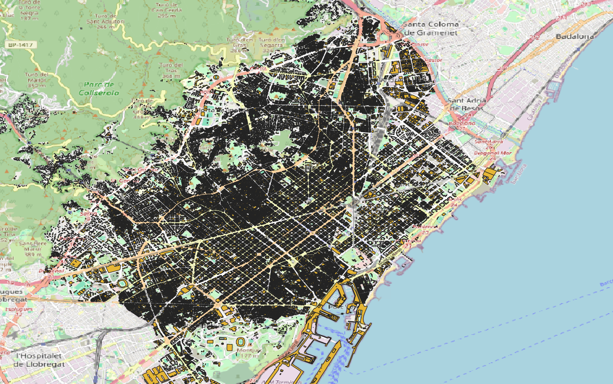

# Barcelona Use Case

## Data sources index

The following links will provide information of each data source import tool:

1. [AEB Consumptions](sources/AEB_consumptions/README.md)
2. [AMB Consumptions](sources/AMB_consumptions/README.md)
3. [CensusTracts](sources/census_tracts/README.md)
4. [Datadis](sources/datadis/README.md)
5. [Districts](sources/districts/README.md)
6. [Elevation Model Global](sources/elevation_model_global/README.md)
7. [Endesa](sources/endesa/README.md)
8. [HUTS](sources/HUTS/README.md)
9. [Inspire (Cadaster data)](sources/Inspire/README.md)
10. [Municipalities](sources/municipalities/README.md)
11. [NDVI Vegetation Index](sources/NDVI/README.md)
12. [Nedgia](sources/Nedgia/README.md)
13. [Neighbourhoods](sources/Neighbourhoods/README.md)
14. [Postal Codes](sources/postal_codes/README.md)
15. [UrbClim HDD/CDD](sources/urbclim_hdd_cdd/README.md)
16. [Weather UrbClim](sources/urbclim/README.md)
