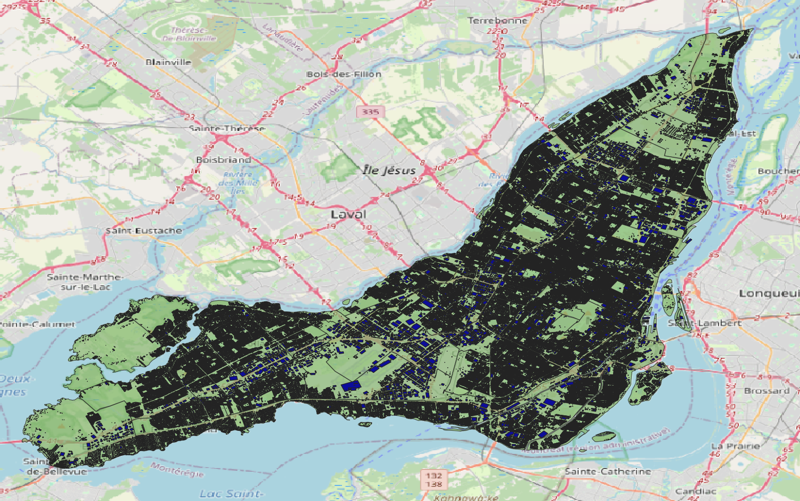

# Montreal Use Case

## Data sources index

The following links will provide information of each data source import tool:

1. [buildings](sources/buildings/README.md)
2. [RTA](sources/RTA/README.md)
3. [Electricity](sources/electricity/README.md)
4. [Gas](sources/gas/README.md)

